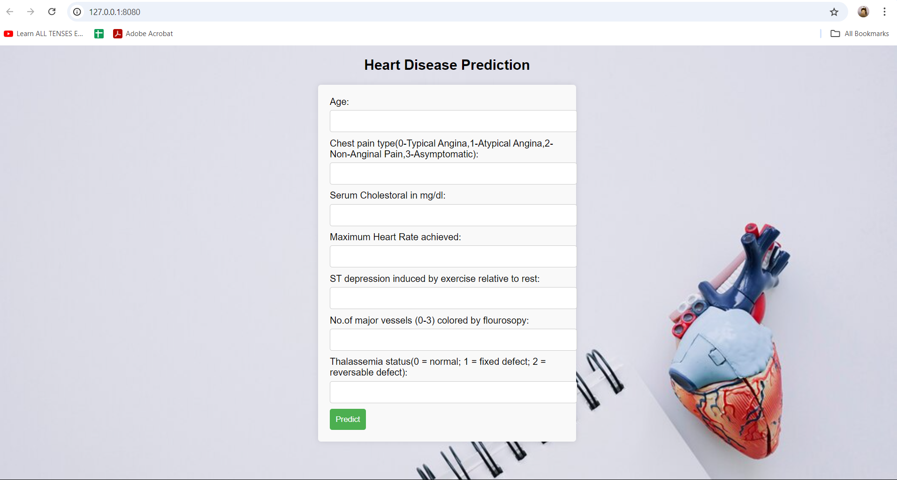

# Heart-disease-prediction-using-ML-deployement-in-GCP-Serverless

### Heart Disease Prediction Using Machine Learning

## Project Overview
This project builds a machine learning model to predict whether a patient is affected by heart disease. The model is developed using Python and Flask and can be deployed for healthcare professionals to facilitate early diagnostics.


## Steps to Develop the ML Model

1. **Collect the Data**: Gather relevant patient health data.
2. **Import Libraries and Load the Data**: Use libraries such as Pandas, NumPy, and Scikit-learn.
3. **Preprocess the Data**: Clean the dataset, handle missing values, and outliers.
4. **Feature Engineering**: Analyze and select the best features for the model.
5. **Model Creation**: Develop and train models, tuning parameters with cross-validation.
6. **Save the Best Model**: Use `joblib` or `pickle` to save the best-performing model.
7. **Deployment**: Deploy the model using a Flask web app.
8. **Develop a Flask App**: 
   - Build a web interface where doctors can input patient data and receive predictions.
   - Launch the app locally to test the predictions.

## Key Features
- **User-friendly Interface**: Allows healthcare professionals to input data and get predictions.
- **Early Diagnostics**: Helps in the early detection of heart disease.

## Getting Started Locally
1. Clone the repository:
   ```bash
   git clone <repository-url>
   cd heart-disease-prediction
   ```

2. Install the required packages:
   ```bash
   pip install -r requirements.txt
   ```

3. Run the Flask application:
   ```bash
   python app.py
   ```

4. Access the app by navigating to `http://localhost:5000`.

## Google Cloud Deployment Steps

> **Note**: Before proceeding, ensure your Flask project is working locally.

1. **Create a Google Account**.
2. **Go to Google Console**: [Google Cloud Console](https://console.cloud.google.com/).
3. **Activate Free Credits** for your Google Cloud account.
4. **Navigate to IAM**: Click on the three horizontal lines on the left side.
5. **Managed Resource**: Select "Managed Resources" from the left-hand panel.
6. **Create a Project**:
   - Click "Create Project".
   - Set a Project ID (use lowercase for the name).
7. **Download Google Cloud SDK**: Use this [link](https://dl.google.com/dl/cloudsdk/channels/rapid/GoogleCloudSDKinstaller.exe) to download the SDK.
8. **Install the SDK**: Run the downloaded `.exe` file.
9. **Open Command Prompt** and navigate to your working directory.
10. **Create an `app.yaml` file**: This file is necessary for App Engine deployment.
    ```bash
    echo. > app.yaml
    ```
11. **Edit the YAML file**:
    - Set the runtime version:
    ```yaml
    runtime: python311
    ```
12. **Initialize Google Cloud SDK**:
    ```bash
    gcloud init
    ```
    - Follow the authentication steps to link your account.
13. **Deploy the Application**:
    ```bash
    gcloud app deploy
    ```
    - A global URL will be provided after deployment.
14. **View the App**:
    ```bash
    gcloud app browse
    ```
    - This will open your deployed web app in the browser.
15. **Disable the App (Optional)**: 
    - If needed, go to the "Managed Resource" settings and select "Disable the Application".

## Conclusion
This project provides a complete pipeline for developing a machine learning model and deploying it to Google Cloud. The deployed app enables healthcare professionals to predict heart disease based on patient data, assisting in early diagnostics and improving patient outcomes.
